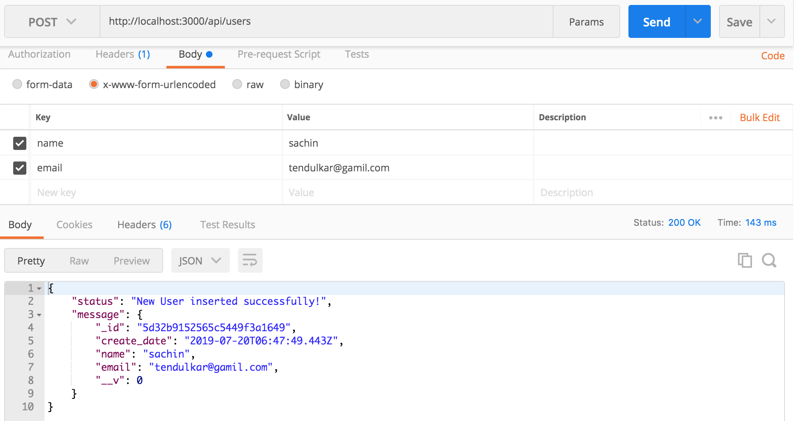
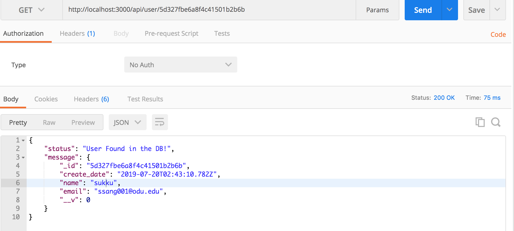
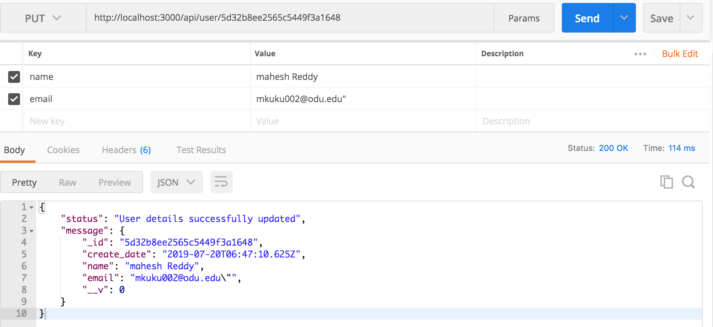
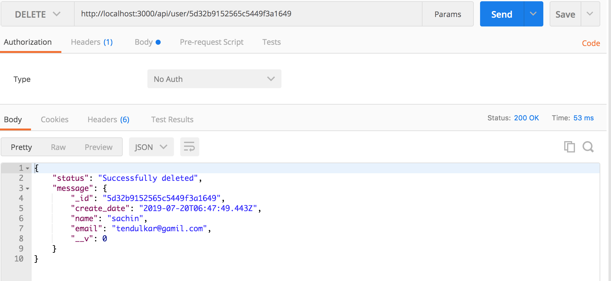

# A Simple REST API  tutorial

A simple REST API application implementation with NodeJs, Express and MongoDb(Mongoose)

Click [here](https://github.com/cmuth001/Secure-REST-API-Express-Node-MongoDB) for Secure REST API.

Implemented a simple API requests and Model to save/retrieve data from the database. 

Implement the following endpoints:
  - GET /api/users list all user
  - POST /api/users create new user
  - GET /api/user/{id} retrieve a single user
  - PUT /api/user/{id} update a single user
  - DELETE /api/user/{id} delete a single user

## Design
 We need to make sure that the base URL of our API endpoint is simple. Here we are designing API for User.
 
 -  /users
 -  /user/{id}
 
 1. Most of the developers make mistake by using verb instead of using noun. Generally developers forgot that we have HTTP (GET, POST, PUT, DELETE) method to describe the endpoint and endup using a verb instead of noun.
 
    Example: API to get all the users
 
     **verb form:**  /getAllUsers 

     **noun form:**  /users
 
 2. Sometime API endpoint should give more information than just by  **/?id='123'**. Design endpoint for query parameters
    - /user?name="chandu", should not use /user?getUserByName="chandu"
    - /user?id=123, should not use /user?getUserById=123
    - /user/?type="abc", should not use /user?getUserByType="abc"
    
    Avoid using verb forms in API endpints, and it will be more apt to use for function name in the backend.
  
 3. Return endpoint as a Json format with status, code, ErrorMessage, body. 
    ```json
    {
      status: "successfully retrieved",
      code: 200,
      data: [{},{},{}]
    }
    ```
    
    ```json
      {
      status: "Failed in retrieving",
      code: 404,
      error: "error message"
      }
    ```
 4. If you are developing a production endpoint, it is always good to maintain ***versioning***.
    
    Like: 
    
    - /v1/users
    - /v1/user/{id}
    
    - /v2/users
    - /v2/user/{id}
    
    Clients think that this is a stable version endpoints.
    
    Do not use versioning style like below
    
    - /v1.1/users
    - /v1.2/users
    
    This shows the endpoint with (dot) versions are unstable versions and it is not clearly visible in the URLs. So always keep it as simple as possible. 
    

 
## Usage
  1. run npm install in your root project folder.
  2. nodemon index.js
  
  
## Outputs
1. **GET /api/users**: List all user

|  |
|:---:|

2. **POST /api/users**: Create new user

|  |
|:---:|

3. **GET /api/user/{id}**: Retrieve a single user

|  |
|:---:|

4. **PUT /api/user/{id}**: Update single user

|  |
|:---:|

5. **DELETE /api/user/{id}**: Delete single user

|  |
|:---:|
